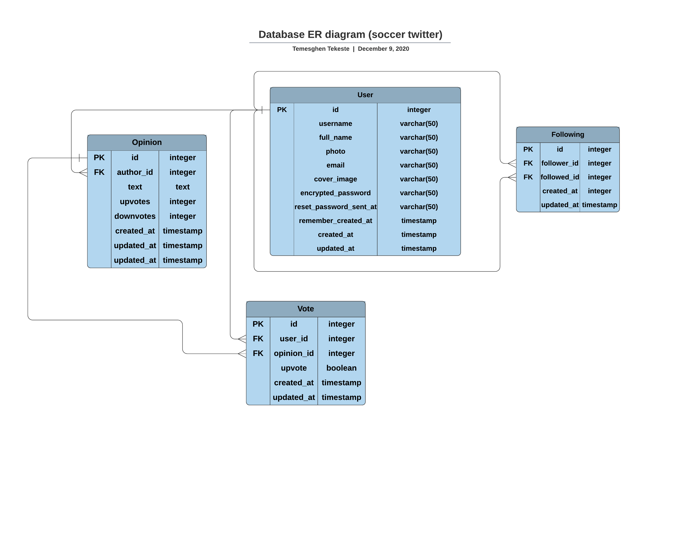
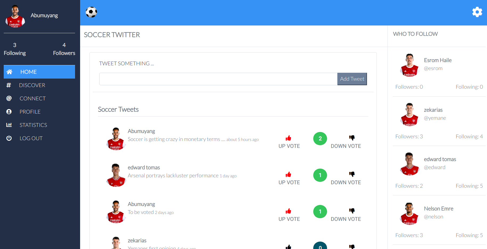
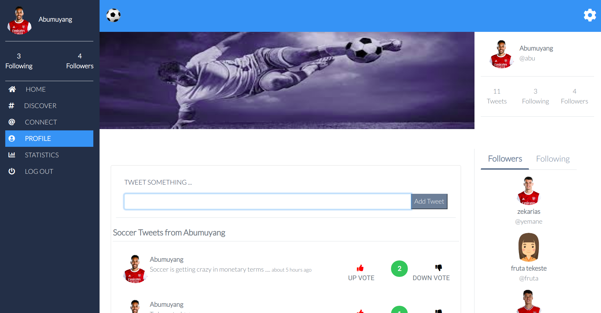
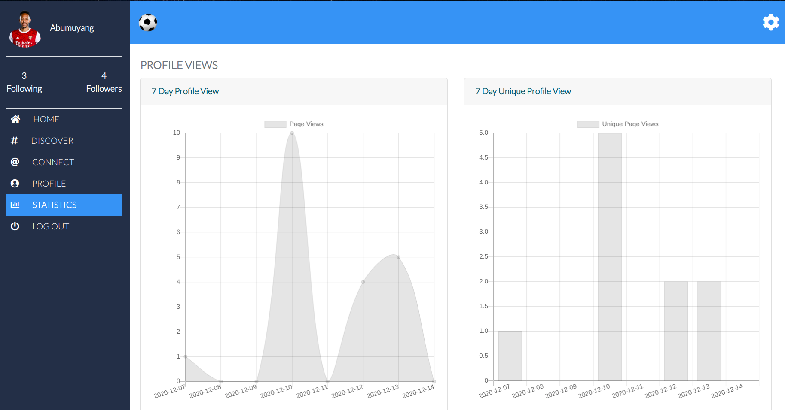

# Soccer Twitter

This project is a capstone project which is part of the requirements of the fulfillment of the microverse main curriculum in the Rails section. The project is about building a site similar to twitter. It is a real world like project with project requirements given to be delivered without missing the deadlines specified in the requirement. Soccer Twitter allows users to tweet their opinions about the popular game soccer in brief and eloquent tweets.

The authentication is done using the Devise gem and Bootsrap and Sass are used to style the views. The statistical reports are done using the chart.js and impressionist & chartquick gems. RSpec and Capybara along with other supplementary gems are used to test the application.

In this project, signed in user can create an opinion, upvote or downvote a particular opinion, and follow or unfollow users in the site. 

      

<div align="center">

[](https://github.com/temesghentekeste/soccer-twitter)
[](https://github.com/temesghentekeste/soccer-twitter/issues)
[](https://github.com/temesghentekeste/soccer-twitter/pulls)

</div>

## 📝 Content

<p align="center">
<a href="#with">Built with</a>&nbsp;&nbsp;&nbsp;|&nbsp;&nbsp;&nbsp;
<a href="#live">Live Demo</a>&nbsp;&nbsp;&nbsp;|&nbsp;&nbsp;&nbsp;
<a href="#erd">ER Diagram</a>&nbsp;&nbsp;&nbsp;|&nbsp;&nbsp;&nbsp;
<a href="#sc">Screenshots</a>&nbsp;&nbsp;&nbsp;|&nbsp;&nbsp;&nbsp;
<a href="#gs">Getting started</a>&nbsp;&nbsp;&nbsp;|&nbsp;&nbsp;&nbsp;
<a href="#author">Author</a>
</p>

## 🔧 Built with<a name = "with"></a>

- Ruby on Rails (Version: 6.0.3.2)
- Ruby (Version: 2.7.1)
- Impresssionist
- Chartkick
- Dotenv Rails
- Cloudinary
- RSpec
- Capybara
- Shoulda Matchers
- Active Storage Validations
- Factory Bot Rails
- Faker
- Bootsrap 4.5.x
- Devise gem
- PostgreSQL

## 🔴 Live Demo <a name = "live"></a>
*Click [here](https://soccer-twitter-temesghen.herokuapp.com/) in order to see a Live Demo of this project.**


## ER Diagram <a name = "erd"></a>




## Screenshots <a name = "sc"></a>






## Getting Started <a name = "gs"></a>

To get a local copy of the repository please run the following commands on your terminal:

```
$ git clone git@github.com:temesghentekeste/soccer-twitter.git
$ cd soccer-twitter
```
- Open the project in your favorite code editor
- Set database credentilas for PostgreSQL in config/database.yml file
~~~bash
$ bundle install
$ rails db:migrate  
~~~


## ✒️  Author <a name = "author"></a>

👤 **Temesghen Tekeste**

- Github: [@temesghentekeste](https://github.com/temesghentekeste)
- Twitter: [@temesghentekes1](https://twitter.com/temesghentekes1)
- Linkedin: [temsghen-tekeste](https://www.linkedin.com/in/temesghentekeste/)


## 🤝 Contributing

Contributions, issues and feature requests are welcome!

Feel free to check the [issues page](https://github.com/temesghentekeste/soccer-twitter/issues).


## 👍 Show your support

Give a ⭐️ if you like this project!

## :clap: Acknowledgements

- The Odin Project: [@theodinproject](https://www.theodinproject.com/)
- Stack Overflow: [@theodinproject](https://stackoverflow.com/)
- Microverse: [@microverse](https://www.microverse.org/)
